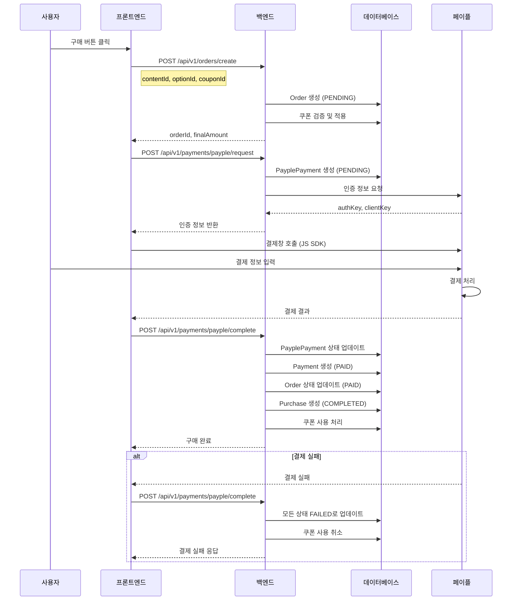
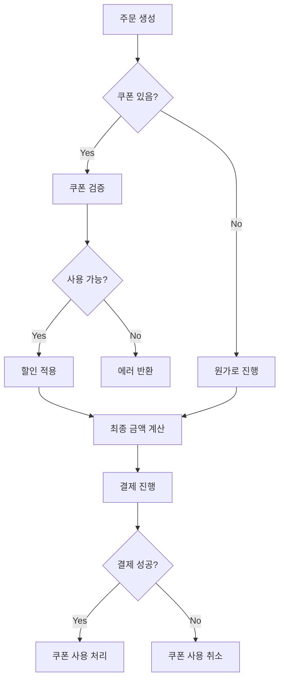

# 페이플(Payple) 결제 플로우 가이드

## 전체 결제 플로우



## 엔티티 상태 변화

### 1. Order (주문)
- **PENDING** → 주문 생성 시 초기 상태
- **PAID** → 결제 완료 시
- **CANCELLED** → 결제 취소 시
- **FAILED** → 결제 실패 시

### 2. PayplePayment (페이플 결제)
- **PENDING** → 결제 요청 시 초기 상태
- **COMPLETED** → 결제 성공 시
- **CANCELLED** → 결제 취소 시
- **FAILED** → 결제 실패 시

### 3. Payment (결제)
- **READY** → 결제 준비 상태
- **PAID** → 결제 완료 시
- **CANCELLED** → 결제 취소 시
- **FAILED** → 결제 실패 시

### 4. Purchase (구매)
- **PENDING** → 구매 대기 상태
- **COMPLETED** → 구매 완료 시
- **CANCELLED** → 구매 취소 시
- **REFUNDED** → 환불 완료 시

## 쿠폰 처리 플로우



## 주요 API 엔드포인트

### 1. 주문 생성
```http
POST /api/v1/orders/create
{
    "contentId": 1,
    "optionType": "COACHING_OPTION",
    "optionId": 1,
    "couponId": 1  // optional
}
```

### 2. 결제 요청
```http
POST /api/v1/payments/payple/request
{
    "orderId": "ORD_20240101_abc123",
    "payMethod": "card",
    "productName": "콘텐츠명"
}
```

### 3. 결제 완료
```http
POST /api/v1/payments/payple/complete
{
    "PCD_PAY_RST": "success",
    "PCD_PAY_OID": "ORD_20240101_abc123",
    "PCD_PAY_AMOUNT": "10000",
    "PCD_PAYER_ID": "payer123",
    // ... 페이플 결과 데이터
}
```

### 4. 결제 취소
```http
POST /api/v1/payments/payple/cancel
{
    "orderId": "ORD_20240101_abc123",
    "reason": "단순 변심"
}
```

## 에러 처리

### 1. 쿠폰 관련 에러
- 이미 사용된 쿠폰
- 만료된 쿠폰
- 다른 사용자의 쿠폰
- 해당 콘텐츠에 사용 불가능한 쿠폰

### 2. 결제 관련 에러
- 중복 결제 시도
- 결제 금액 불일치
- 페이플 API 오류

### 3. 주문 관련 에러
- 판매 중지된 콘텐츠
- 이미 구매한 콘텐츠
- 옵션 정보 불일치

## 트랜잭션 관리

모든 결제 관련 작업은 트랜잭션으로 관리되어야 합니다:

```java
@Transactional
public void completePayment(PayplePaymentResultDto result) {
    // 1. PayplePayment 업데이트
    // 2. Payment 생성
    // 3. Order 상태 변경
    // 4. Purchase 생성
    // 5. 쿠폰 사용 처리
    // 모든 작업이 성공해야 커밋
}
```

## 보안 고려사항

1. **결제 검증**
   - 결제 금액 일치 여부 확인
   - 페이플 서버에서 결제 상태 재확인

2. **권한 확인**
   - 본인 주문만 조회/취소 가능
   - 본인 쿠폰만 사용 가능

3. **중복 방지**
   - merchantUid 유니크 제약
   - 동일 콘텐츠 중복 구매 방지

4. **로깅**
   - 모든 결제 관련 활동 로깅
   - PaymentLog 엔티티에 기록
